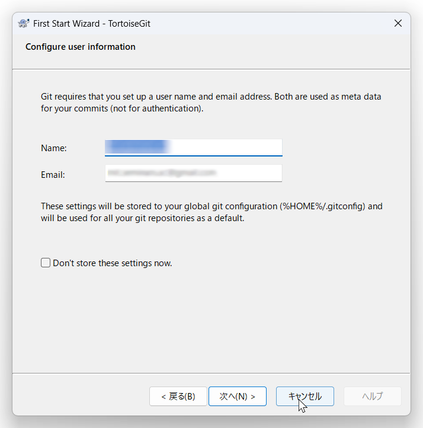

# Git & TortoiseGit インストール手順書

この手順書は、バージョン管理システムであるGitと、そのGUIクライアントであるTortoiseGitのインストール手順を解説するものです。

## 1. Gitのインストール

下記以外はわかる範囲でご自由にせっていただいて構いません。

10. **HTTPS接続ライブラリの選択**:
11. **行末改行コードの設定**:

### 手順

1.  **インストーラーの開始**: ダウンロードしたGitのインストーラーを起動します。
2.  **ライセンスの確認**: 「GNU General Public License」の画面が表示されます。「Next」をクリックします。
3.  **インストール先の選択**: Gitをインストールするフォルダを選択します。特に理由がなければデフォルトのままで「Next」をクリックします。
4.  **コンポーネントの選択**: インストールするコンポーネントを選択します。
    * **【変更点】** 「On the Desktop」のチェックを外します。（デスクトップにショートカットが不要な場合）
    * **【変更点】** 「Associate .sh files to be run with Bash」のチェックを外します。
5.  **スタートメニューの登録**: スタートメニューに表示されるフォルダ名を設定します。デフォルトの「Git」のままで「Next」をクリックします。
6.  **デフォルトエディタの選択**: Gitが使用するデフォルトのテキストエディタを選択します。特に理由がなければデフォルトのままで「Next」をクリックします。
7.  **ブランチ名の設定**: 新しいリポジトリを作成する際のデフォルトのブランチ名を設定します。基本的にGitHubからクローンするので、masterのままでもいいですが、気になる人はmainに変えてもらってもいいです。
8.  **PATH環境変数の設定**: コマンドプロンプトなどでGitコマンドを使用するための設定です。「Use Git from the command line and also from 3rd-party software」が選択されていることを確認し、「Next」をクリックします。
9.  **SSHクライアントの選択**: 「Use bundled OpenSSH」が選択されていることを確認し、「Next」をクリックします。
10. **HTTPS接続ライブラリの選択**:
    * **【変更点】** 「Use the OpenSSL library」を選択します。
11. **行末改行コードの設定**:
    * **【変更点】** 「Checkout as-is, commit as-is」を選択します。
12. **ターミナルエミュレータの選択**: 「Use MinTTY (the default terminal of MSYS2)」が選択されていることを確認し、「Next」をクリックします。
13. **`git pull` の挙動設定**: 「Fast-forward or merge」が選択されていることを確認し、「Next」をクリックします。
14. **認証情報ヘルパーの選択**: 「Git Credential Manager」が選択されていることを確認し、「Next」をクリックします。
15. **追加オプションの設定**:
    * **【変更点】** 「Enable symbolic links」のチェックを外します。
16. **インストール**: 「Install」ボタンをクリックしてインストールを開始します。
17. **完了**: インストールが完了したら、「Launch Git Bash」と「View Release Notes」のチェックを外して、「Finish」をクリックします。

## 2. TortoiseGitのインストール

### TortoiseGitインストール時のポイント

日本語仕様にはしないこととしましょう。正しいコマンドが覚えられないので、英語のままでお願いします。

#### 1. SSHクライアントの選択

この画面では、TortoiseGitが使用するSSHクライアントを選択します。

* **ポイント**: **「OpenSSH, Git default SSH Client」** を選択することをおすすめします。
    * Gitをインストールした際に付属してくるOpenSSHを使用する設定です。多くの場面で互換性の問題が発生しにくく、一般的な選択肢です。
    * 「TortoiseGitPlink」はPuTTYをベースにしたクライアントで、特定の環境では有用ですが、初心者の方や特にこだわりがない場合はOpenSSHで問題ありません。

---

#### 2. セットアップウィザードの完了

TortoiseGitのインストールが完了した画面です。

* **ポイント**: **「Run first start wizard」にチェックが入っていることを確認して「Finish」をクリックします。**
    * このチェックボックスをオンにしておくことで、インストール完了後に初期設定ウィザードが起動し、Gitの基本的な設定（ユーザー情報など）をスムーズに行うことができます。
    * 「Show Changelog」は変更履歴を表示するオプションなので、チェックを外しても問題ありません。

---

#### 3. ユーザー情報の設定

初期設定ウィザードの一部で、Gitでコミット（変更履歴の記録）を行う際に使用されるユーザー情報を設定します。設定しないとGitコマンド実行時に入力を求められて面倒です。

* **ポイント**:
    * **Name**: 自分の名前やニックネームを入力します。**GitHubなどのリモートリポジトリサービスで使用しているユーザー名と同じにすると分かりやすいでしょう。**
    * **Email**: 自分のメールアドレスを入力します。こちらも**GitHubなどに登録しているメールアドレスと同じものを使用する**のが一般的です。
    * これらの情報はコミットログに記録され、誰が変更を行ったかを示す重要な情報となります。
    * 設定が完了したら、「次へ」をクリックして進みます。

以上でGitとTortoiseGitのインストールは完了です。