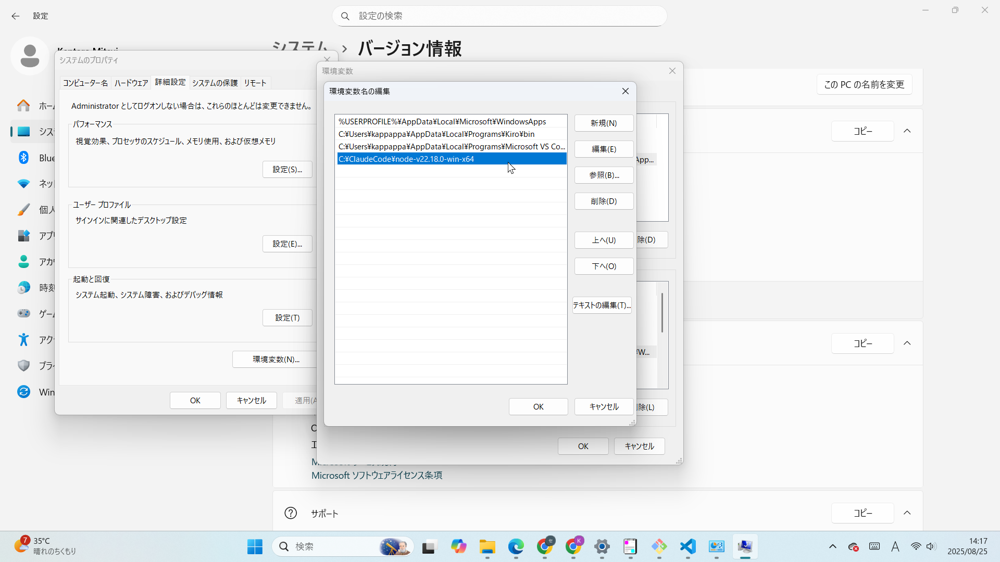

# nodeをインストール

インストールといっても展開してパスを通すのみです。
場所は任意でいいですが、googleクラウドからダウンロードした資材の配下のほうがいいでしょう。

`node-v22.18.0-win-x64.zip`

ユーザ変数でもシステム変数でも構いません。




コマンドプロンプトで下記が表示されればOKです。

`node -v`

```shell
v22.18.0
```