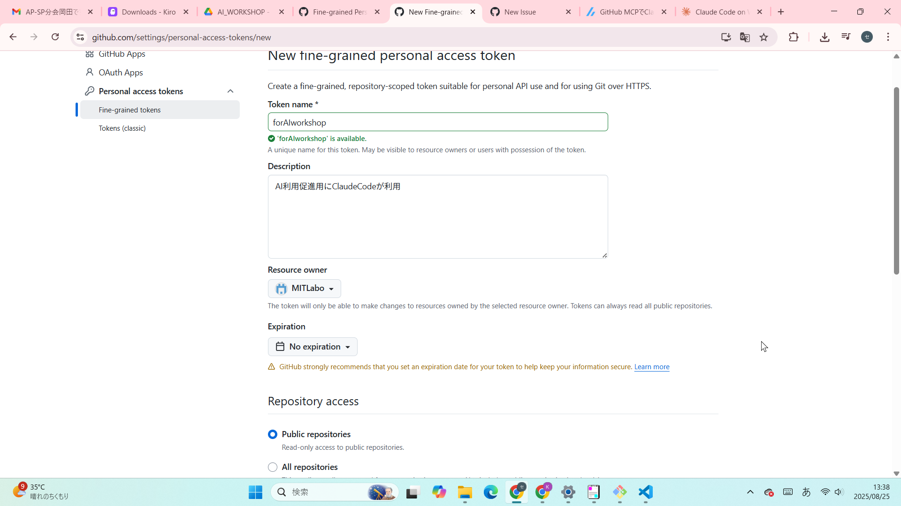
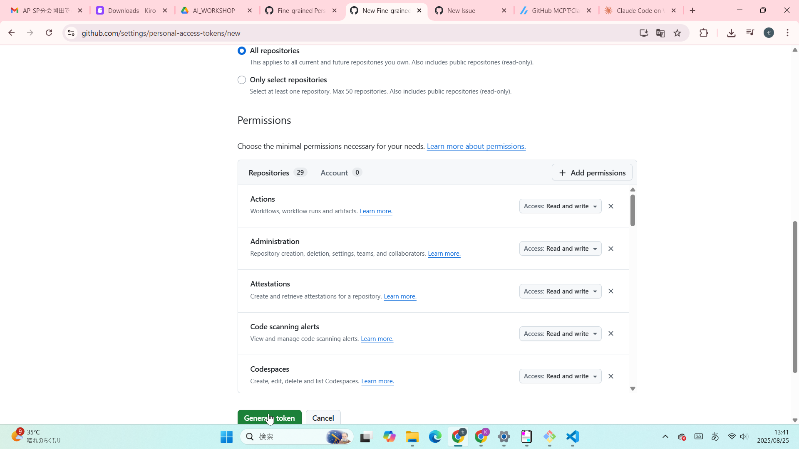
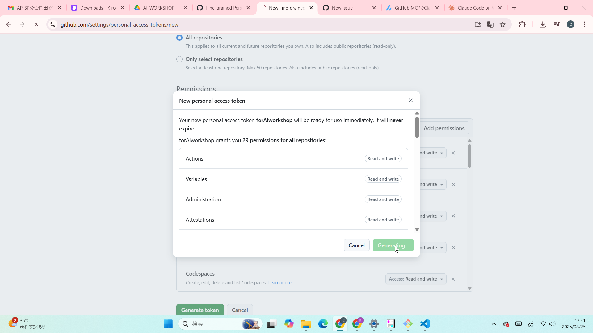
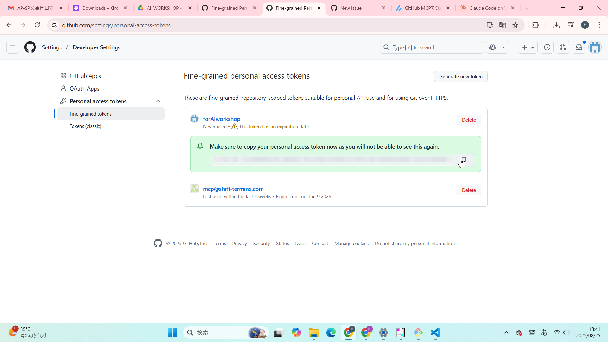

# personal access tokenの作成

まずはGitHubでPersonal Access Tokenを作成します。
トークンでログインするため、パスワードなどは不要になります。
classicとFine-grainの2つあり、違いは下記です。
自動化に向いているFine-grainを使います。

| 認証方法 | 使用するトークン | メリット | 推奨される用途 | 
 | ----- | ----- | ----- | ----- | 
| `gh auth login` | クラシックPAT | ブラウザ経由で簡単に認証できる | 個人的な手動操作 | 
| 環境変数 | ファイングレインPAT | 最小限の権限で安全性が高い | スクリプト、自動化 |

1. GitHub右上のアイコン → Settings
2. Developer settings → Personal access tokens → Tokens (Fine-grained personal tokens)
3. Generate new token (Fine-grained personal tokens)

**注意**

画面上は`Expiration`が設定されていませんが、一年以内の期日を設定してください。Claude CodeからGitHubを操作するためのGitHub CLIの仕様上1年以上の期間が、トークンに設定されているとエラーになります。

4. 権限はすべてチェック：
read-onlyしか選べないものを除き、すべてread-write権限とする。

トークンが表示されたらコピーして保存。一回しか見れないので注意。