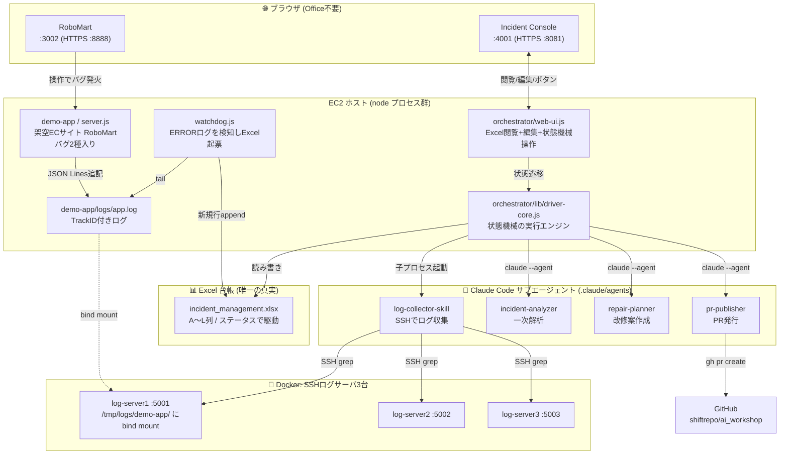
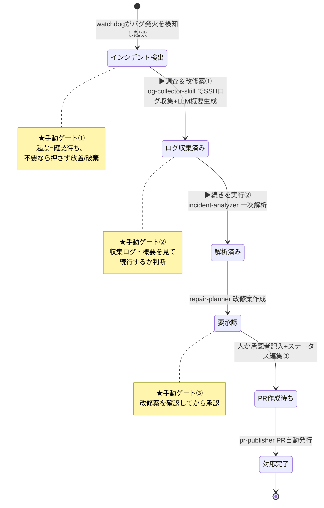
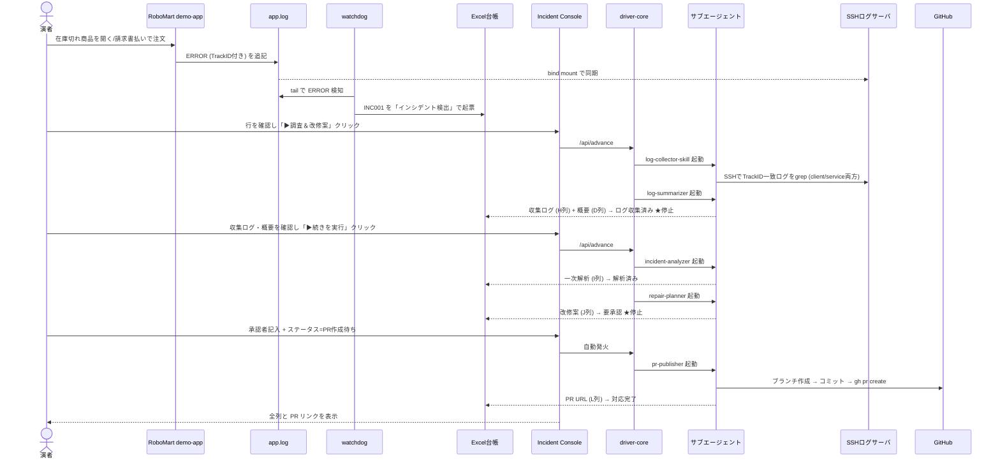
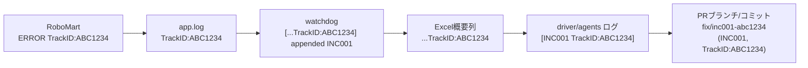

# ARCHITECTURE — 構成とデモの流れ

Issue #22 AI 自動改修デモを構成するサービスの関係性と、デモの一連の流れを図で示す。
詳細な設計は [SPEC.md](SPEC.md)、時系列の脚本は [DEMO_FLOW.md](DEMO_FLOW.md) を参照。

---

## 1. サービス構成図

デモは 4 つの実行コンポーネント + Excel 台帳 + 既存の SSH ログサーバで構成される。

**ポイント**:
- **Excel が唯一の真実**。全コンポーネントは Excel の「ステータス列」を介して協調する。
- **書き手は限定**: watchdog は起票のみ、driver (と各エージェント) が処理結果を書き戻す。Web UI 経由の人手編集は driver 経由。
- **demo-app のログ**は `demo-app/logs/` を Docker server1 の `/tmp/logs/demo-app/` に bind mount し、log-collector-skill が SSH 越しに grep する。

---

## 2. デモの流れ (状態遷移)

Excel の 1 行 (1 インシデント) が辿る状態遷移。**★ が手動ゲート** (人がボタンを押す/編集するまで進まない)。

- **▶ 調査＆改修案 ボタン①**: `インシデント検出` → `ログ収集済み` を実行 (SSHログ収集+LLM概要生成)、`ログ収集済み` で停止。収集ログ(H列)・概要(D列)を見て続行を判断する。
- **▶ 続きを実行 ボタン②**: `ログ収集済み` → `解析済み` → `要承認` を実行し、要承認で停止。
- **手動編集③**: 承認者を記入しステータスを `PR作成待ち` にすると、pr-publisher が自動発火して PR を発行 → `対応完了`。

---

## 3. デモのシーケンス (時系列)

---

## 4. TrackID による一貫トレーサビリティ

システムを貫く一意 ID として **TrackID** を全ログに伝播させている。1つのインシデントを、発火から PR まで同じ TrackID で追える。

Web UI 下部のコンソールで各ログソース (webui / watchdog / robomart / app.log) を切り替えると、同じ TrackID が全経路に現れるのが確認できる。

---

## 5. 関連ドキュメント

| ドキュメント | 内容 |
|-------------|------|
| [README.md](README.md) | デモの実行手順・設定 |
| [SPEC.md](SPEC.md) | 全体設計・Excel列定義・状態機械・エージェント責務 |
| [DEMO_FLOW.md](DEMO_FLOW.md) | E2E 時系列シナリオ (演者トーク付き脚本) |
